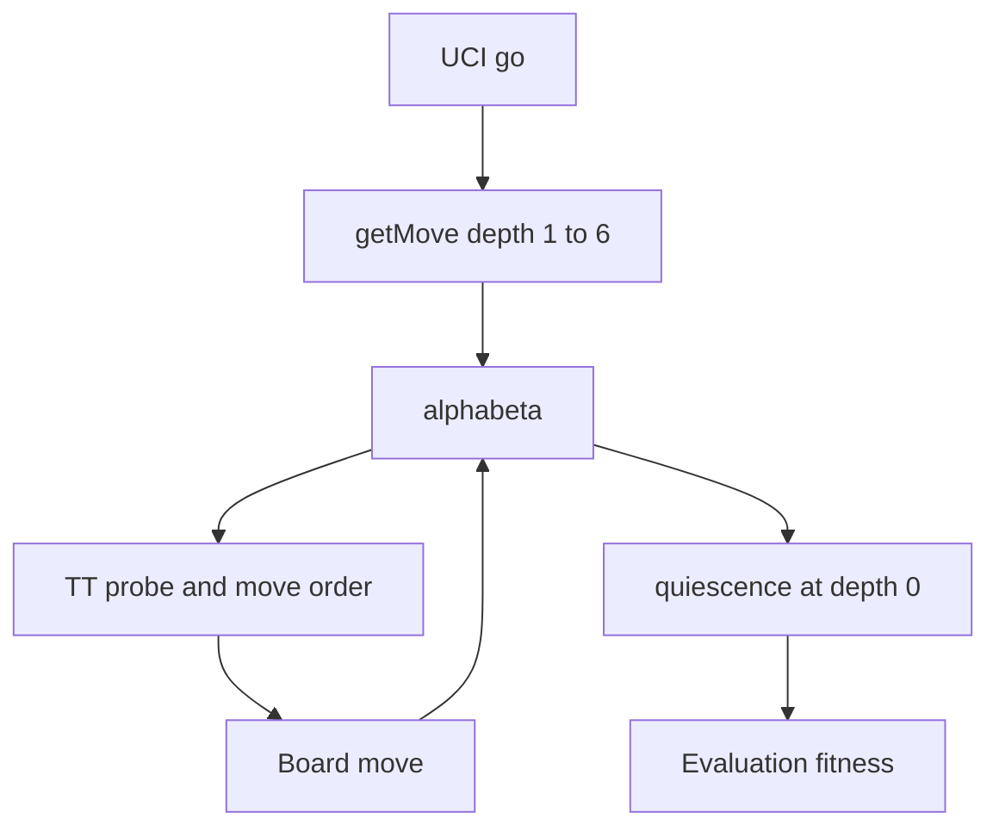

# 0001. Port Tactician into Neptune

Date: 2026-10-01

## Status

Accepted

## Context

Neptune is a C++ port of Tactician, a Java UCI chess engine. Move generation is already in place: bitboards, make/unmove, pseudo-legal generation, and legality checks. Perft matches the standard suite. The engine itself is not. `Brain.java` is a depth-6 iterative-deepening negamax with alpha-beta, quiescence, killer moves, and a transposition table. `brain.cpp` only returns the last legal move.

Tactician’s UCI loop only handles `uci`, `isready`, `position fen`, and `go`. It never accepts `position startpos` and never applies a `moves` list, so a GUI cannot play a game against it. Neptune’s parser has the same hole, and it also appends anything after the FEN into the FEN string.

A neural network is planned later. Training will live in Python and inference will run in C++. That work is out of scope here. The search written now should call evaluation through one function, so the hand-written eval can later be replaced by a loaded weight file without rewriting the search.

## Decision

Port Tactician’s search, evaluation, and hashing onto Neptune’s existing board and move generator. Use Neptune’s types. Do not copy Java objects, and do not copy the board on every node.

### What is ported

- Search from `Brain.java`: iterative deepening to 6 plies, negamax alpha-beta, killer moves, and move ordering (transposition-table move, then captures, then killers, then quiet moves). Quiescence only follows recaptures on the same square.
- Static evaluation from `Evaluation.java` and `PawnKingHashTable.java`, with the same weights: material, bishop pair, doubled / isolated / passed pawns, king safety, rook files, and castling rights. The pawn/king table holds 64K entries.
- Zobrist hashing from `PositionHasher.java`: piece placement, side to move, en passant file, and castling rights, plus a second hash of pawns and kings only.
- A transposition table of depth, score, best move, and node type (PV, cut, or all).

### What is not ported

- `AlgebraicNotation.java`. Neptune already prints UCI long algebraic moves.
- The hardcoded `/Users/philleski/chess.log` logger. Print a UCI `info` line instead.
- Java’s board-copy search. Search with `Board::move` and `Board::unmove`.
- Time controls (`wtime`, `btime`, `movetime`). `go` searches a fixed depth, as Tactician does. `go depth N` is accepted so tests can request a shallower search.
- The neural network. Python training and C++ inference remain the intended split, and are not designed here.

### Differences from the Java engine

- Legality uses the existing `MoveGen::isLegal`. Checkmate is no legal moves while the king is attacked. Stalemate is a draw. Tactician searched moves that left the king hanging and treated a captured king as a loss, so it scored some stalemates as losses. Mate-in-one behavior stays the same. Shorter mates are preferred with the same `FITNESS_LARGE` / `FITNESS_MOVE` penalty, using `Board::ply` in place of `fullMoveCounter`.
- On a beta cutoff, store the move that caused the cutoff. Tactician stored the previous best move.
- Zobrist keys are seeded once with a fixed RNG seed so hashes are stable across runs. They will not match Java’s `java.util.Random`. Nothing needs them to.
- The transposition table is power-of-two and always-replace, about 64MB. Tactician used `hash % (2 * size - 1)` and about 512MB (`32 * 1024 * 1024` entries of two longs). `ucinewgame` clears the table.
- Hashes are updated inside `Board::move` and restored in `unmove` by saving the previous values on `Undo`. `setPosition` recomputes them from scratch.

### Board, move generation, and UCI

- `Board` gains `positionHash` and `positionHashPawnsKings`, and `isCapture` for move ordering.
- `MoveGen::legalMovesFast` gains a `capturesOnly` argument. Quiescence includes captures and en passant, and skips quiet moves and castling. That matches `LegalMoveGenerator.legalMovesFast(board, true)`.
- New files, wired into `src/Makefile`: `evaluation.h` / `evaluation.cpp`, and `transposition.h` / `transposition.cpp`. `brain.cpp` replaces the stub with `getMove`, `alphabeta`, and `quiescentSearch`.
- UCI accepts `position startpos` and `position fen <fen>`, each optionally followed by `moves`. Each UCI move (`e2e4`, `e7e8q`) is matched against legal moves so castling and en passant flags are set, then played with `Board::move`. `ucinewgame` resets the board and clears the table. After search, print `bestmove` and `info depth ... score cp ... pv ...`.

### Tests

Keep `test/perft.py`. Add a Python driver in the same style, spawning `../src/neptune`, covering `TestBrain.java` and `TestEvaluation.java`:

- Mate in one: after `f3 e5 g4`, White plays `d8h4`.
- Fastest mate: `4K3/7r/5p2/5k2/8/8/1r6/8 b` plays `b2b8`.
- Fork: the sequence ending in `c6` plays `b5c7`, not the pawn capture.
- A lost position still returns a move: `8/8/8/8/8/7k/q7/7K w`.
- The position that overflowed the Java table index still returns a move.
- Eval orderings, through a `_eval <fen>` debug command like `_perft`: opening king safety, endgame king centralization, pawn shield, doubled / isolated / passed pawns, castling rights, and material sign.
- Hash sanity: make then unmake restores the hash; two move orders to the same FEN match; `position startpos moves` matches `position fen`.

Tactical cases use depth 6, matching the Java tests. Cases that only check that some move is returned may use a shallower depth if depth 6 is slow.

## Consequences

- Neptune can play as a UCI engine with the same search and evaluation as Tactician, on the faster make/unmove board.
- Stalemate is scored as a draw, which is a behavior change from Tactician.
- Hashes and transposition-table layout differ from Java, so saved Java tables cannot be reused. None exist.
- Evaluation stays behind `Evaluation::fitness(Board*)`. A later network replaces that function and leaves search, hashing, and UCI alone.
- Time management is still absent. `go` always searches a fixed depth.
